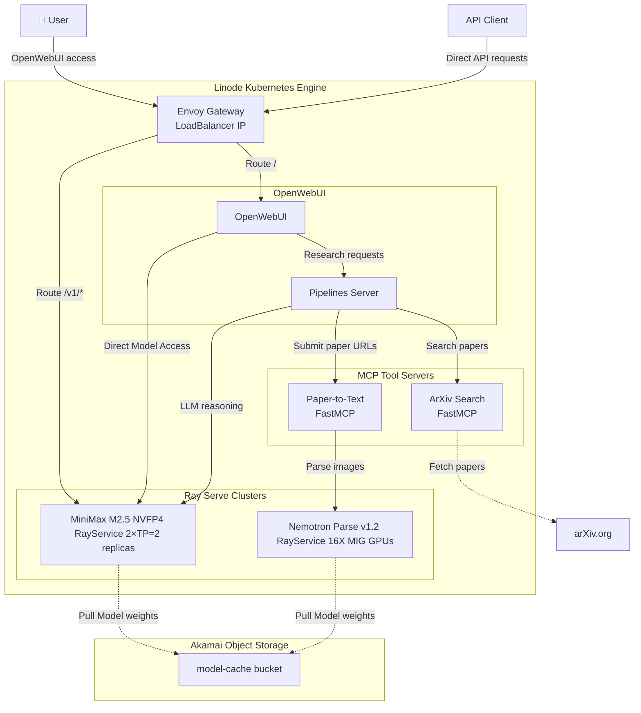
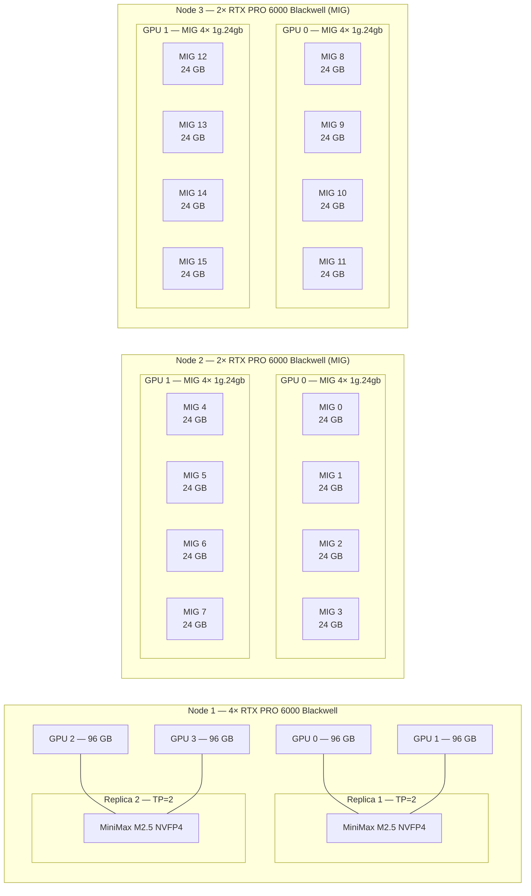
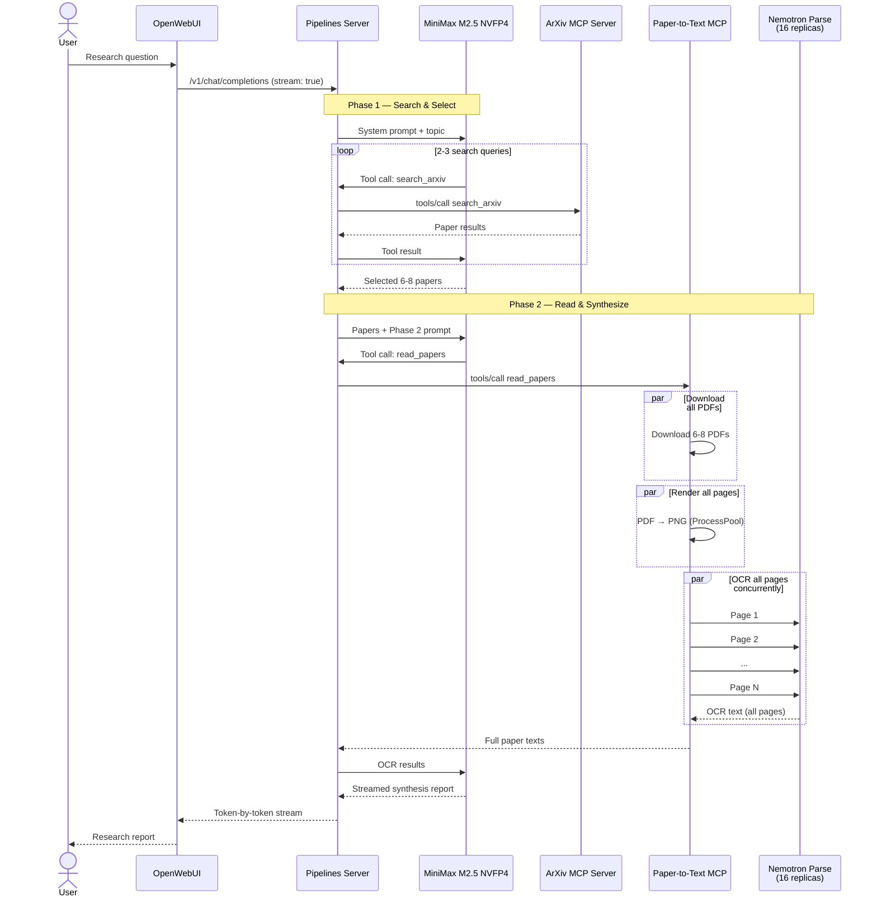

# KubeRay Multi-modal LLM Inference on Linode Kubernetes Engine

Deploy a GPU-accelerated deep research agent on Linode Kubernetes Engine with MCP tool-use, real-time streaming, and an OpenAI-compatible API.

## Overview

This repository demonstrates how to deploy a production-ready deep research agent using KubeRay on Linode Kubernetes Engine (LKE). A user asks a research question and the system autonomously searches arXiv, reads full papers via OCR, and synthesizes a comprehensive research report — all streamed in real time through OpenWebUI or a standard OpenAI-compatible API, both accessed via a shared Envoy Gateway.

**Learning Objectives**: Orchestrate GPU workloads on Kubernetes, serve LLMs with Ray Serve, wire up MCP tool servers, configure NVIDIA MIG partitioning, and set up secure API gateways.

**Current Stack**:
- **MiniMax M2.5 NVFP4** — Frontier MoE reasoning model (NVFP4 quantized, 2× TP=2 replicas on 4 Blackwell GPUs, tool-use, 190K context)
- **NVIDIA Nemotron Parse v1.2** — High-throughput OCR model (16 fixed replicas on MIG-partitioned GPUs, 1 MIG device each)
- **MCP Servers** — ArXiv search + Paper-to-Text OCR, exposed as Streamable HTTP tool servers
- **OpenWebUI** — Chat UI with the deep research pipeline available as a selectable model

## Features

- 🔬 **Deep research pipeline** — Two-phase MCP agent: search & select papers → OCR & synthesize report
- 🛠️ **MCP tool servers** — ArXiv search and PDF-to-text OCR via FastMCP (Streamable HTTP transport)
- 🚀 **OpenAI-compatible API** — Standard `/v1/chat/completions` endpoint via Envoy Gateway
- 🌐 **Unified Gateway** — Single LoadBalancer for both OpenWebUI (`/`) and API (`/v1/*`) traffic with path-based routing
- 🎮 **GPU-accelerated inference** — NVIDIA Blackwell GPUs with native FP4 Tensor Cores and MIG partitioning (8× RTX PRO 6000)
- 🧩 **NVIDIA MIG** — Multi-Instance GPU splits 4 physical GPUs into 16 isolated 24 GB instances
- ⚡ **NVFP4 quantization** — 4-bit weights with FP8 micro-tensor scaling, purpose-built for Blackwell's 5th-gen Tensor Cores (~3.5× memory savings, 2× replicas)
- 🔧 **Infrastructure-as-Code** — Terraform for cluster provisioning, Tilt for deployment orchestration
- 🔐 **Secure by default** — Bearer token authentication, deny-by-default security policies
- 📊 **Full observability** — Grafana dashboards, Prometheus metrics, Ray Dashboard
- ⚡ **Real-time streaming** — Research progress streamed token-by-token to the UI
- 📦 **Model weight caching** — Akamai Object Storage accelerates cold starts via s5cmd
- 🔥 **Eager warmup** — All 16 OCR replicas are pre-heated at deploy time for instant first-request response

## Architecture

### System Overview



### Node Topology & GPU Configuration

Each physical GPU on the 2-GPU nodes is partitioned into 4× MIG instances using the `all-1g.24gb` profile (24 GB VRAM each). The GPU Operator's MIG Manager handles partitioning automatically via node labels. CDI (Container Device Interface) assigns each pod exactly one MIG instance as CUDA device 0 — no runtime patching needed.



**GPU allocation summary**:

| Node           | GPUs                         | MIG                | Model               | Workers                           |
|----------------|------------------------------|--------------------|---------------------|-----------------------------------|
| 4-GPU node     | 4× RTX PRO 6000 (96 GB each) | Disabled           | MiniMax M2.5 NVFP4 (2× TP=2 replicas) | 1 worker pod               |
| 2-GPU node × 2 | 2× RTX PRO 6000 each         | 4× 1g.24gb per GPU | Nemotron Parse v1.2 | 8 worker pods per node (16 total) |

### Deep Research Pipeline

The research pipeline is a two-phase MCP agentic workflow orchestrated by MiniMax M2.5 NVFP4:



**Throughput design**: The Paper-to-Text MCP server fires all page OCR requests concurrently (no batching). With 16 Nemotron replicas (each processing up to 8 sequences via vLLM continuous batching), the cluster handles ~128 concurrent OCR sequences. A typical research query (8 papers × 30 pages = 240 pages) completes in roughly the time of 2 sequential OCR requests.

**Components**:
- **Linode LKE** — Managed Kubernetes cluster with GPU node pools (1× 4-GPU + 2× 2-GPU Blackwell nodes)
- **NVIDIA GPU Operator** — GPU driver/runtime management with CDI and MIG Manager
- **KubeRay Operator** — Ray cluster lifecycle management on Kubernetes
- **Ray Serve** — Scalable LLM serving framework:
  - **MiniMax M2.5 NVFP4** — Frontier MoE model for reasoning and tool-use (NVFP4 quantized, 2× TP=2 replicas on 4 GPUs)
  - **Nemotron Parse v1.2** — OCR model (16 fixed replicas, 1 MIG GPU each, pre-warmed at deploy time)
- **OpenWebUI** — Chat interface with persistent storage and custom branding
- **Pipelines Server** — Hosts the MCP research pipeline, exposes it as a selectable model in OpenWebUI
- **MCP Servers** — FastMCP-based tool servers (ArXiv search, Paper-to-Text OCR)
- **Envoy Gateway** — Unified API gateway routing both OpenWebUI (`/`) and API (`/v1/*`) traffic with path-based routing and flexible authentication (Bearer token for API, allow-all for OpenWebUI's built-in auth)
- **kube-prometheus-stack** — Prometheus + Grafana with Ray-specific dashboards
- **Tilt** — Live development environment with automatic reloading

### Why NVFP4 on Blackwell

The NVFP4 quantization of MiniMax M2.5 is purpose-built to exploit Blackwell's hardware capabilities:

- **5th-Gen Tensor Cores with native FP4 datapaths** — Blackwell introduces hardware-accelerated FP4 compute via the second-generation Transformer Engine with micro-tensor scaling. The NVFP4 format (4-bit weights + blockwise FP8 scales per 16 elements) maps directly to what the Tensor Cores execute natively — no software dequantization overhead.
- **~3.5× memory reduction** — Quantizing the MoE expert layers from BF16 to NVFP4 shrinks the model from ~450 GB to ~130 GB on disk. This is what enables running 2× TP=2 replicas on 4 GPUs instead of a single TP=4 replica, doubling serving throughput.
- **CUTLASS fused MoE kernels** — vLLM's dedicated `trtllm_nvfp4_moe` and `linear_qutlass_nvfp4` kernels fuse MoE expert routing with FP4 GEMM operations into single Tensor Core calls, maximizing hardware utilization.
- **Selective quantization preserves quality** — Only the MoE expert MLP layers (~90%+ of parameters) are quantized; attention layers stay in BF16. Combined with natural top-k routing calibration on a diverse dataset (code, math, reasoning, multilingual), this achieves near-lossless accuracy (86.2% MMLU-Pro vs the original BF16 model).
- **MoE models are memory-bandwidth-bound** — During inference, tokens route to different experts causing many weight reads. FP4 weights mean proportionally higher tokens/second since less data moves across the memory bus per expert computation.

**Request Flow** (Deep Research Pipeline):
1. User submits a research question via OpenWebUI (at `http://<gateway>/`) or directly via the Gateway API (at `http://<gateway>/v1/chat/completions`)
2. Gateway routes OpenWebUI traffic to the web interface; API traffic to MiniMax M2.5 NVFP4
3. OpenWebUI routes to the Pipelines server, which runs the MCP research pipeline
4. **Phase 1 — Search & Select**: MiniMax M2.5 NVFP4 calls the ArXiv MCP server to search for and select 6-8 relevant papers
5. **Phase 2 — Read & Synthesize**: MiniMax M2.5 NVFP4 calls the Paper-to-Text MCP server, which downloads PDFs, renders pages to PNG, and OCRs all pages concurrently through 16 Nemotron Parse replicas, then writes a comprehensive report with inline citations
6. The report streams back token-by-token through the Gateway to the user

## Prerequisites

**Required Tools** (with installation links):

- **Linode Account** — [Sign up](https://login.linode.com/signup) | Generate API token from [Cloud Manager](https://cloud.linode.com/profile/tokens)
- **Terraform** (>= 1.0) — [Install Guide](https://developer.hashicorp.com/terraform/install)  
  Quick: `brew install terraform` (macOS) or `choco install terraform` (Windows)
- **Tilt** (>= 0.30) — [Install Guide](https://docs.tilt.dev/install.html)  
  Quick: `curl -fsSL https://raw.githubusercontent.com/tilt-dev/tilt/master/scripts/install.sh | bash`
- **kubectl** — [Install Guide](https://kubernetes.io/docs/tasks/tools/)  
  Quick: `brew install kubectl` (macOS) or `choco install kubernetes-cli` (Windows)
- **HuggingFace Account** — [Sign up](https://huggingface.co/join) | Create [access token](https://huggingface.co/settings/tokens) for model downloads
- **Akamai Object Storage** — For model weight caching (create a bucket and generate access keys from [Cloud Manager](https://cloud.linode.com/object-storage))

## Quick Start

```bash
# 1. Clone this repository
git clone <your-repo-url>
cd multimodal-kuberay

# 2. Configure Terraform variables
cp terraform.tfvars.example terraform.tfvars
# Edit terraform.tfvars with your Linode API token and cluster preferences

# 3. Configure environment variables
cp .env.example .env
# Edit .env with:
#   HUGGINGFACE_TOKEN  — Your HuggingFace access token
#   OPENAI_API_KEY     — Any arbitrary secret for API authentication
#   OBJ_ACCESS_KEY     — Akamai Object Storage access key
#   OBJ_SECRET_KEY     — Akamai Object Storage secret key
#   OBJ_ENDPOINT_HOSTNAME — e.g. us-ord-1.linodeobjects.com
#   OBJ_REGION         — e.g. us-ord-1

# 4. Deploy everything (one command!)
make all

# Expected timeline:
# - Provision LKE cluster with GPU nodes: ~5-10 minutes
# - Install operators (GPU, KubeRay, Envoy): ~5 minutes
# - Upload models to Object Storage: ~10-15 minutes
# - Deploy MiniMax M2.5 NVFP4 + Nemotron Parse + MCP servers: ~10-15 minutes
```

Once complete, access the Tilt UI at http://localhost:10350 to monitor deployment status.

## Configuration

### Terraform Variables (`terraform.tfvars`)

| Variable             | Description                   | Default                           | Options/Notes                                                                                               |
|----------------------|-------------------------------|-----------------------------------|-------------------------------------------------------------------------------------------------------------|
| `linode_token`       | Linode API token              | (required)                        | Generate from Cloud Manager                                                                                 |
| `cluster_label`      | Cluster name                  | `"myllm"`                         | Any descriptive string                                                                                      |
| `region`             | Linode region                 | `"us-lax"`                        | [Available regions](https://www.linode.com/docs/products/platform/get-started/guides/choose-a-data-center/) |
| `kubernetes_version` | Kubernetes version            | `"1.34"`                          | Check LKE supported versions                                                                                |
| `gpu_big_node_type`  | Large GPU node type (MiniMax) | `"g3-gpu-rtxpro6000-blackwell-4"` | 4× Blackwell GPUs — hosts MiniMax M2.5 NVFP4 (2× TP=2 replicas)                                                                      |
| `gpu_big_node_count` | Number of large GPU nodes     | `1`                               | 1 node for the MoE model                                                                                    |
| `gpu_node_type`      | Small GPU node type (OCR)     | `"g3-gpu-rtxpro6000-blackwell-2"` | 2× Blackwell GPUs — MIG-partitioned for Nemotron Parse (8 instances/node)                                   |
| `gpu_node_count`     | Number of small GPU nodes     | `2`                               | 2 nodes × 8 MIG instances = 16 OCR replicas                                                                 |
| `tags`               | Resource tags                 | `["kuberay", "llm", "gpu"]`       | For organization and tracking                                                                               |

### Environment Variables (`.env`)

| Variable                | Required | Description                                                   |
|-------------------------|----------|---------------------------------------------------------------|
| `HUGGINGFACE_TOKEN`     | Yes      | HuggingFace access token for model downloads                  |
| `OPENAI_API_KEY`        | Yes      | Arbitrary secret for API authentication (Bearer token)        |
| `OBJ_ACCESS_KEY`        | Yes      | Akamai Object Storage access key                              |
| `OBJ_SECRET_KEY`        | Yes      | Akamai Object Storage secret key                              |
| `OBJ_ENDPOINT_HOSTNAME` | Yes      | Object Storage endpoint (e.g. `us-ord-1.linodeobjects.com`)   |
| `OBJ_REGION`            | Yes      | Object Storage region (e.g. `us-ord-1`)                       |
| `MODEL_BUCKET`          | No       | Bucket name for cached model weights (default: `model-cache`) |
| `WEBUI_ADMIN_EMAIL`     | No       | OpenWebUI admin email, auto-created on first boot (default: `admin@demo.local`) |
| `WEBUI_ADMIN_PASSWORD`  | No       | OpenWebUI admin password (default: `demo1234`) |

### Model Configuration

**Deployed Models**:

1. **MiniMax M2.5 NVFP4** (`minimax-m2.5`)
   - **Role**: Primary reasoning model — orchestrates the research pipeline via tool-use
   - **Developer**: MiniMax (quantized by lukealonso using NVIDIA ModelOpt)
   - **Architecture**: Mixture of Experts (MoE), 230B total parameters, NVFP4 quantized (~130 GB on disk)
   - **Quantization**: NVFP4 — 4-bit weights with blockwise FP8 (E4M3) scale factors per 16 elements. Only MoE expert MLP layers (gate/up/down projections) are quantized; attention layers remain in BF16 for quality preservation. Achieves 86.2% on MMLU-Pro (Math 94.7%, Physics 91.5%)
   - **GPU Allocation**: 2× TP=2 replicas on a single 4-GPU Blackwell node (2 GPUs per replica)
   - **Context Window**: 190,000 tokens
   - **Inference Stack**: vLLM 0.15.1+ with CUTLASS NVFP4 MoE kernels, FLASH_ATTN attention backend
   - **Capabilities**: Tool calling, chain-of-thought reasoning, structured output
   - **Model Source**: Cached in Akamai Object Storage, synced via init container to emptyDir at boot

2. **NVIDIA Nemotron Parse v1.2** (`nvidia/NVIDIA-Nemotron-Parse-v1.2`)
   - **Role**: OCR engine — converts PDF pages to structured text for the research pipeline
   - **Developer**: NVIDIA
   - **GPU Allocation**: 1 MIG instance (24 GB) per replica, 16 replicas across 2× 2-GPU nodes
   - **MIG Profile**: `all-1g.24gb` — 4 instances per physical GPU, managed by GPU Operator MIG Manager
   - **Context Window**: 8,192 tokens
   - **Capabilities**: Page-level OCR with layout preservation, 30+ language support
   - **Throughput**: 16 fixed replicas × 8 concurrent sequences = 128 parallel OCR requests; all replicas pre-warmed at deploy time
   - **Model Source**: Cached in Akamai Object Storage; a DaemonSet (`nemotron-model-cache`) syncs weights to a hostPath per node, and all 16 workers mount it read-only (2 downloads total instead of 16)

### MCP Tool Servers

| Server        | Endpoint                                | Tools                              | Description                                         |
|---------------|-----------------------------------------|------------------------------------|-----------------------------------------------------|
| ArXiv Search  | `http://mcp-arxiv-search-svc:8000/mcp`  | `search_arxiv`, `get_paper_info`   | Search arXiv by query, retrieve paper metadata      |
| Paper-to-Text | `http://mcp-paper-to-text-svc:8000/mcp` | `read_papers`, `read_single_paper` | Download PDFs, render pages, OCR via Nemotron Parse |

Both servers use FastMCP with Streamable HTTP transport and Bearer token authentication.

## Usage

### Accessing Services

Once deployed, the following services are available:

- **Tilt Dashboard**: http://localhost:10350  
  Monitor deployment status, view logs, and manage resources

- **OpenWebUI**: Access via Gateway at `http://<GATEWAY_IP>/`  
  Get the Gateway IP: `kubectl get gateway llm-gateway -o jsonpath='{.status.addresses[0].value}'`  
  Chat interface — select "MiniMax M2.5 NVFP4" for direct chat or "Deep Research Agent" for the research pipeline  
  Note: OpenWebUI has its own authentication (username/password), no API key required

- **MiniMax Ray Dashboard**: http://localhost:8265 (via Tilt port-forward)  
  View cluster metrics, task execution, and resource utilization

- **MiniMax API**: http://localhost:8000 (via Tilt port-forward)  
  Direct access to MiniMax M2.5 NVFP4 serving endpoint (bypasses Gateway)

- **Nemotron Parse Ray Dashboard**: http://localhost:18265 (via Tilt port-forward)  
  Monitor OCR model replicas and GPU utilization across 16 MIG instances

- **Grafana**: http://localhost:3000 (via Tilt port-forward)  
  Pre-configured Ray dashboards for model cache, serve deployments, and LLM metrics

- **Gateway API**: Access via Gateway at `http://<GATEWAY_IP>/v1/chat/completions`  
  Get the Gateway IP: `kubectl get gateway llm-gateway -o jsonpath='{.status.addresses[0].value}'`  
  OpenAI-compatible API with Bearer token authentication (use `OPENAI_API_KEY` from `.env`)

### Making API Requests

#### Using Test Scripts

```bash
# Smoke test — simple chat completion via the Gateway
make test

# Full research pipeline test — streams a deep research query
make test-research

# Custom research topic
./scripts/test-pipeline.sh "attention mechanisms in transformers"
```

#### Accessing OpenWebUI

**Via Gateway (recommended)**:
```bash
# 1. Get the Gateway service IP
export GATEWAY_IP=$(kubectl get gateway llm-gateway -o jsonpath='{.status.addresses[0].value}')

# 2. Open OpenWebUI in your browser
echo "OpenWebUI: http://${GATEWAY_IP}/"
# Navigate to the URL and sign up/sign in (OpenWebUI creates an admin account on first run)

# 3. Select a model in the UI:
#    - "MiniMax M2.5 NVFP4" for direct chat
#    - "Deep Research Agent" for the full research pipeline
```

**Note**: OpenWebUI uses its own authentication system (username/password), separate from the API Bearer token.

#### Manual API Requests

**Chat completion (via Gateway)**:
```bash
# 1. Get the Gateway service IP
export SERVICE_IP=$(kubectl get gateway llm-gateway -o jsonpath='{.status.addresses[0].value}')

# 2. Send a request to MiniMax M2.5 NVFP4
curl -X POST "http://${SERVICE_IP}/v1/chat/completions" \
  -H "Authorization: Bearer ${OPENAI_API_KEY}" \
  -H "Content-Type: application/json" \
  -d '{
    "model": "minimax-m2.5",
    "messages": [
      {"role": "system", "content": "You are a helpful research assistant."},
      {"role": "user", "content": "List 3 open problems in quantum computing."}
    ],
    "max_tokens": 400,
    "temperature": 1.0
  }'
```

**Deep research query (via Pipelines)**:
```bash
# The Pipelines server runs on port 9099 (port-forwarded by Tilt for openwebui-pipelines)
curl --no-buffer \
  -H "Authorization: Bearer ${OPENAI_API_KEY}" \
  -H "Content-Type: application/json" \
  "http://localhost:9099/v1/chat/completions" \
  -d '{
    "model": "mcp_research_pipeline",
    "messages": [
      {"role": "user", "content": "diffusion models for protein structure prediction"}
    ],
    "stream": true
  }'
```

**Authentication Notes**:
- **API Endpoints** (`/v1/*`): Require Bearer token authentication. Use `Authorization: Bearer ${OPENAI_API_KEY}` header with the value from your `.env` file.
- **OpenWebUI** (`/`): Uses built-in username/password authentication. No API key required. Create an admin account on first access.

### Monitoring Deployment Status

```bash
# Check overall status
make status

# View Tilt UI for detailed resource status
# Open http://localhost:10350 in your browser

# Check specific Kubernetes resources
kubectl get gateway llm-gateway
kubectl get rayservice ray-serve-minimax
kubectl get rayservice ray-serve-nemotron-parse
kubectl get pods -l app.kubernetes.io/name=kuberay-operator
```

## Development Workflow

For detailed development workflows, code style guidelines, and agentic coding instructions, see [AGENTS.md](./AGENTS.md).

### Common Commands

```bash
make help           # Show all available commands
make status         # Check deployment status
make up             # Start Tilt in interactive mode
make ci             # Run Tilt in CI mode (non-interactive)
make down           # Tear down Tilt resources (keeps cluster running)
make test           # Smoke test the MiniMax M2.5 NVFP4 API
make test-research  # Run a full research pipeline test
make nuke-cache     # Delete cached models and destroy Object Storage bucket
make destroy        # Destroy the entire LKE cluster
make clean          # Clean up local files
```

### Making Changes

- **Kubernetes Manifests** (`manifests/*.yaml`) — Tilt auto-reloads on save
- **Pipeline Code** (`serve/*.py`) — Tilt auto-reloads the ConfigMap and restarts the Pipelines pod
- **MCP Servers** (`mcp/*.py`) — Tilt auto-reloads the ConfigMap and restarts the MCP pods
- **Tiltfile** — Tilt auto-reloads on save
- **Terraform** (`*.tf`) — Run `make plan` then `make apply`

## Cleanup

### Stop Kubernetes Resources (Keep Cluster)

```bash
make down
```

This tears down all Kubernetes resources (Ray Serve, Gateway, MCP servers, OpenWebUI, operators) while keeping your LKE cluster running. It also cleans up CRDs, NVIDIA node labels, stale webhooks, and Tilt-created namespaces to restore a vanilla LKE cluster.

### Destroy Everything

```bash
# Destroy the entire LKE cluster and all infrastructure
make destroy

# Clean up local files (kubeconfig, Terraform state)
make clean
```

**Warning**: `make destroy` permanently deletes your LKE cluster and all associated resources.

## Project Structure

```
multimodal-kuberay/
├── Makefile                        # Build/deploy/test commands
├── Tiltfile                        # Kubernetes deployment orchestration (~690 lines)
├── main.tf                         # Terraform: LKE cluster with GPU node pools
├── variables.tf                    # Terraform: Input variables
├── outputs.tf                      # Terraform: Outputs (kubeconfig, cluster ID)
├── terraform.tfvars.example        # Example Terraform configuration
├── .env.example                    # Example environment variables
├── assets/
│   ├── custom.css                  # OpenWebUI custom branding CSS
│   └── Akamai Cloud - *.png        # Akamai logo variants for OpenWebUI branding
├── hack/
│   ├── monitoring-values.yaml      # kube-prometheus-stack Helm values
│   └── grafana-dashboards/         # 8 Grafana dashboards (Ray metrics + DCGM GPU exporter)
│       ├── data_grafana_dashboard.json
│       ├── dcgm_exporter_grafana_dashboard.json
│       ├── default_grafana_dashboard.json
│       ├── model_cache_grafana_dashboard.json
│       ├── serve_deployment_grafana_dashboard.json
│       ├── serve_grafana_dashboard.json
│       ├── serve_llm_grafana_dashboard.json
│       └── train_grafana_dashboard.json
├── manifests/
│   ├── gateway.yaml                # Envoy Gateway + SecurityPolicy + ClientTrafficPolicy
│   ├── rayservice-minimax.yaml     # MiniMax M2.5 NVFP4 RayService (2× TP=2 replicas on 4 GPUs)
│   ├── rayservice-nemotron-parse.yaml  # Nemotron Parse v1.2 RayService (16 MIG replicas)
│   ├── nemotron-model-cache.yaml   # DaemonSet: per-node model cache for Nemotron Parse (hostPath)
│   ├── nemotron-warmup-job.yaml    # Warmup Job — pre-heats all 16 OCR replicas
│   ├── openwebui.yaml              # OpenWebUI + Pipelines server deployments
│   ├── mcp-arxiv-search.yaml       # ArXiv Search MCP server
│   ├── mcp-paper-to-text.yaml      # Paper-to-Text OCR MCP server
│   ├── model-upload-job.yaml       # Job: caches models to Object Storage
│   ├── ray-podmonitor.yaml         # Prometheus PodMonitor for Ray metrics
│   └── kustomization.yaml          # Kustomize configuration
├── mcp/
│   ├── common.py                   # Shared BearerAuthMiddleware for MCP servers
│   ├── arxiv_search_server.py      # FastMCP server: search_arxiv, get_paper_info
│   └── paper_to_text_server.py     # FastMCP server: read_papers, read_single_paper
├── serve/
│   └── mcp_research_pipeline.py    # Deep research agent (MCP-based pipeline)
├── scripts/
│   ├── model-sync.sh               # s5cmd-based Object Storage model downloader
│   ├── model-upload.sh             # HuggingFace → Object Storage caching
│   ├── nuke-bucket.sh              # Delete cached models and destroy Object Storage bucket
│   ├── warmup-nemotron.sh          # Warmup: sends 256 concurrent dummy requests
│   ├── seed-streaming-config.sh    # OpenWebUI postStart hook
│   ├── test-llm.sh                 # MiniMax M2.5 NVFP4 API smoke test
│   └── test-pipeline.sh            # Deep research pipeline test
├── AGENTS.md                       # Guide for AI coding agents
└── README.md                       # This file
```

## Troubleshooting

### Common Issues

**Tilt fails to connect to cluster**
```bash
# Ensure KUBECONFIG is set correctly
export KUBECONFIG=$(pwd)/kubeconfig
make up
```

**Pods stuck in Pending on GPU nodes**
```bash
# Check GPU operator installation status
kubectl get pods -n gpu-operator

# View GPU operator logs
kubectl logs -n gpu-operator -l app=nvidia-gpu-operator

# Check MIG configuration state on nodes
kubectl get nodes -l nvidia.com/mig.config -o custom-columns='NODE:.metadata.name,MIG_CONFIG:.metadata.labels.nvidia\.com/mig\.config,MIG_STATE:.metadata.labels.nvidia\.com/mig\.config\.state'

# Verify MIG devices are advertised
kubectl get nodes -l nvidia.com/mig.config -o jsonpath='{range .items[*]}{.metadata.name}: {.status.allocatable.nvidia\.com/gpu} GPUs{"\n"}{end}'
```

**Model download is slow or stuck**
```bash
# First run uploads models to Object Storage (~5-10 min for MiniMax M2.5 NVFP4)
# Subsequent runs sync from Object Storage (much faster)
# Check the model-upload job and worker init container logs:
kubectl logs job/model-upload -f
kubectl logs -l ray.io/node-type=worker -c model-download --tail=100 -f
```

**Gateway not accessible**
```bash
# Check Gateway status and IP allocation
kubectl get gateway llm-gateway
kubectl describe gateway llm-gateway

# Verify both HTTPRoutes are configured (API + OpenWebUI)
kubectl get httproute llm-route
kubectl get httproute openwebui-route

# Check SecurityPolicies
kubectl get securitypolicy llm-gateway-auth
kubectl get securitypolicy openwebui-route-auth

# Test Gateway routing
export GATEWAY_IP=$(kubectl get gateway llm-gateway -o jsonpath='{.status.addresses[0].value}')
curl -I http://${GATEWAY_IP}/  # Should return OpenWebUI (200 or 30x redirect)
```

**Authentication failures (401 Unauthorized)**
```bash
# Verify your OPENAI_API_KEY matches between .env and your API request
# The Bearer token in the Authorization header must match exactly
```

**Research pipeline times out or produces no output**
```bash
# Check that both MCP servers are healthy
kubectl get pods -l app=mcp-arxiv-search
kubectl get pods -l app=mcp-paper-to-text

# Verify Nemotron Parse is serving (needed for OCR)
kubectl get rayservice ray-serve-nemotron-parse

# Check all 16 replicas are running
kubectl exec $(kubectl get pod -l ray.io/node-type=head,app=nemotron-parse -o name | head -1) -- \
  python3 -c "import ray; from ray import serve; ray.init('auto'); s=serve.status(); print({n: {k:v for k,v in d.replica_states.items()} for n,d in s.applications['nemotron-parse'].deployments.items()})"

# Check the Pipelines server logs for errors
kubectl logs -l app=openwebui-pipelines --tail=100 -f
```

**Nemotron Parse workers show 0/1 Ready**
```bash
# KubeRay injects a readiness probe that checks both raylet health AND Serve
# proxy health (port 8000).  Only workers hosting a vLLM replica run a Serve
# proxy.  The rayservice-nemotron-parse.yaml overrides this with a raylet-only
# probe.  If you see 0/1, check the probe:
kubectl get pod <pod-name> -o jsonpath='{.spec.containers[0].readinessProbe}' | python3 -m json.tool

# It should check only localhost:52365/api/local_raylet_healthz (not port 8000)
```

### Getting More Help

- **Tilt UI**: http://localhost:10350 — Shows detailed resource status and logs
- **MiniMax Ray Dashboard**: http://localhost:8265 — View cluster and serving metrics
- **Nemotron Parse Ray Dashboard**: http://localhost:18265 — Monitor 16 OCR replicas across MIG instances
- **Grafana**: http://localhost:3000 — Ray-specific dashboards (default login: admin/prom-operator)
- **Kubernetes Logs**: `kubectl logs <pod-name>` — View detailed pod logs
- **AGENTS.md**: Detailed development workflows and troubleshooting

---

**Questions or Issues?** This is a learning/demo project. Feel free to experiment, break things, and rebuild! The entire environment can be recreated with `make all`.
